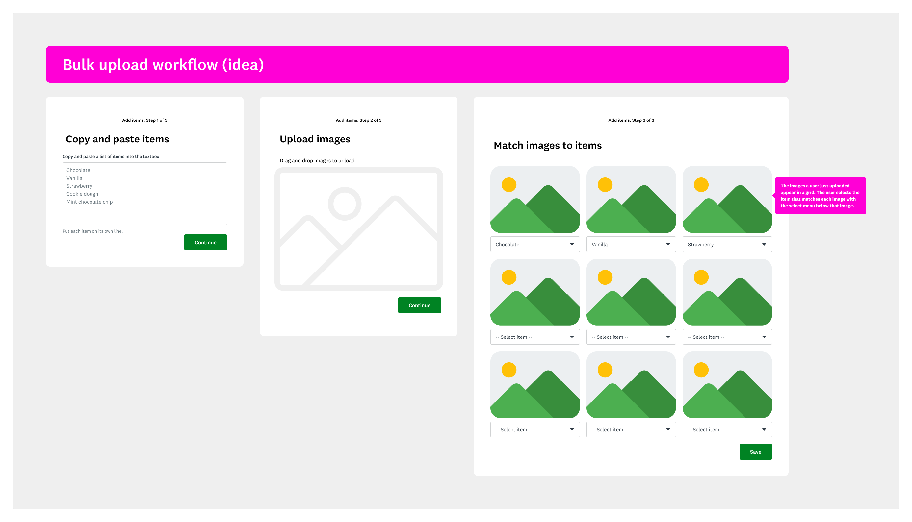
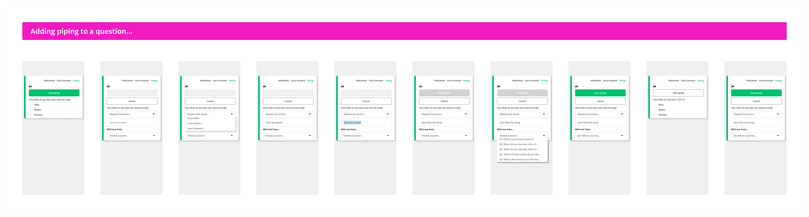

# Design
I'm a capable visual designer with formal training. Here are some things I do in the course of my content design and technical writing work.

## Concepts, mockups, and wireframes
When I work with design and product partners, I don't just write or edit words in user interfaces. I help solve problems. That means I sometimes need to create concepts. I typically do these as wireframes or low-fidelity mockups.

## Prototypes
Static designs are great. But they can only do so much. When I design a complex concept, I like to build a prototype to show stakeholders exactly how I intend for things to work.

