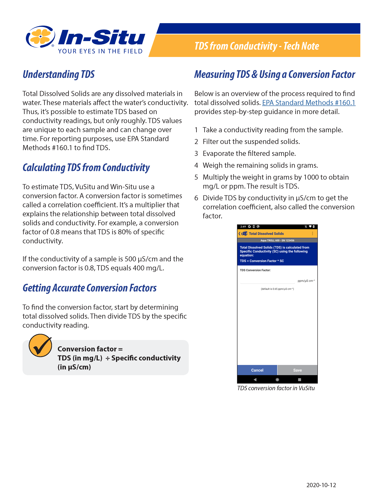

# Technical writing
I make outstanding user manuals and online documentation. That's because I stick to plain language, break information into manageable chunks, and combine images with text as much as possible. (Those aren't all my secrets!)

