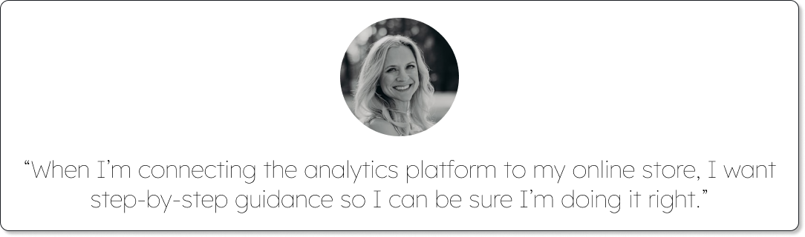

# I help build products for collecting and making sense of data.
Hey there! I’m Nick, and I’m a content designer. I’ve been designing products that educate and inform since 2014. With a background in instructional design, technical writing, and UX, I’m equipped to tackle any sort of challenge.

My focus is SaaS. Specifically, I make data-centric products more intuitive. 

## My work makes it easier to connect to and configure data sources.
A data source can be a piece of physical hardware or an app. Either way, the user may need to go through a setup process to make sure that source collects the right data at the right time.
Examples:
- Programming a scientific instrument—like a barometer or a pH sensor—to take hourly measurements.
- Writing a survey to collect customer feedback about a recent store visit.

## I help users get important data into their preferred tools.
People might use a variety of tools to organize, analyze, and share data. But first, they need to get the data into those tools from the source.

**Examples:**
- Uploading data from a barometer to an FTP server.
- Exporting survey responses to a spreadsheet application.
- Connecting a financial app to a bank in order to access financial transactions.

## My work assists people in organizing and tagging data.
Data is easier to parse and use when it’s organized. File and folder systems make this possible.

**Examples:**
- Creating a separate folder for each week of pH readings.
- Tagging all survey responses that mention the word “return.”

## I ensure the data analysis process feels intuitive.
Graphs, charts, and other visualizations help people translate data into actionable insights. This step in the journey is about spotting trends and making informed predictions.

**Examples:**
- Viewing graphs and charts of survey data.
- Looking at pH measurements over the past year.
- Understanding credit health in a financial app.

## My work helps users share data with stakeholders.
Working with data can be a team process. So data platforms provide collaboration and sharing functionality.

**Examples:**
- Giving a team member permission to edit a document.
- Copying a link so others can view a dashboard.
- Asking a manager or supervisor to approve an invoice. 